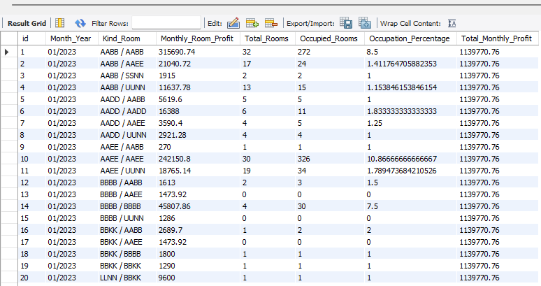
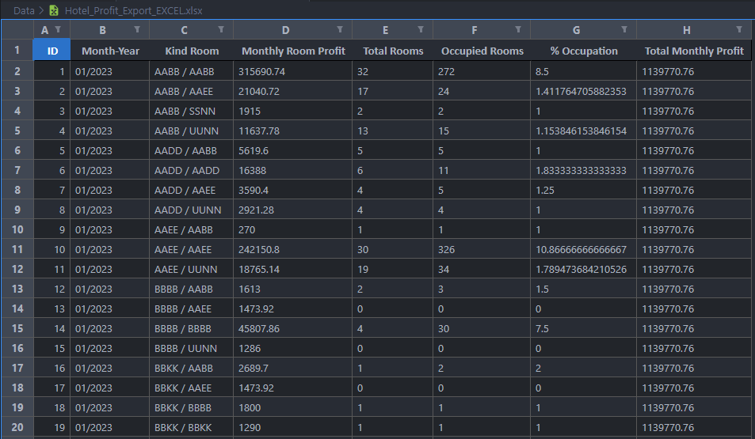

Análise de dataset de rede de hotéis, tratamento e implantação dos dados em MySQL Server com Python.

Utilizado:
- Python
- Data models (SQLAlchemy)
- CRUD (SQLAlchemy)
- MySQL
- Classes (OOP)

```
📦 Hotels
┣ 📂 Data       - Dados brutos e tratados
┃ ┃
┃ ┣ 📜 Hotel_Profit_Analysis.xlsx           -   Dataset tratado
┃ ┣ 📜 Hotel_Profit_Analysis_Dashed.xlsx    -   Dataset tratado
┃ ┣ 📜 Hotel_Profit_Export_CSV.csv          -   Dataset exportado do DB MySQL
┃ ┣ 📜 Hotel_Profit_Export_EXCEL.xlsx       -   Dataset exportado do DB MySQL
┃ ┗ 📜 Hotel_Profit_Raw.xlsx                -   Dataset Original
┃
┣ 📂 Database   - Projeto para integrar os dados brutos ao DB MySQL
┃ ┃
┃ ┣ 📜 db_login.py      - Login, sessão e conexão com o DB
┃ ┣ 📜 hotels_main.py   - API externa com o DB, inserção de arquivos tratados no DB
┃ ┣ 📜 models.py        - Definição dos modelos de dados - tabela e tipos das colunas
┃ ┣ 📜 mysql.env        - URL de conexão com o DB
┃ ┗ 📜 mysql_api.py     - API interna para operações de CRUD direto com o DB
┃
┗ 📂 Notebooks  - Análise Exploratória dos Dados
  ┃
  ┣ 📜 DB test.ipynb            - Testes iniciais com o DB
  ┗ 📜 Hotels_Analysis.ipynb    - Análise dos dados brutos e emissão dos Datasets tratados
```

Para reprodução local:

- Ter o Python 3.10 instalado
- Instalar as bibliotecas:
  ```
  pandas
  numpy
  pprint
  dateutil
  sqlalchemy
  dotenv
  ```

Instalar **MySQL Server 8.0.34**, **MySQL WorkBench 8.0.34** na **configuração inicial padrão**
- Usuário: Andrew | Senha: 123456 | Porta: 3306 (padrão)
- Banco de Dados: test_db | Tabela: hotel_income (serão criados na execução do projeto)

Durante a instalação é possível criar o usuário de teste, caso esta opção não apareça, também é possível via o MySQL CLI (linha de comando) que é instalado junto, com os comandos, em sequência:
  ```SQL
  \connect root@localhost
  CREATE USER 'Andrew'@'%' IDENTIFIED BY '123456';
  ALTER USER 'root'@'localhost' IDENTIFIED BY '123456', 'Andrew'@'%' IDENTIFIED BY '123456';
  FLUSH PRIVILEGES;
  ```
Execução da Análise e Deploy no MySQL Server:

- Executar todo o notebook **Hotels_Analysis.ipynb**, ele irá:
  - Executar a análise e tratamento dos dados
  - Emitir os Dataset tratados:
      - 📜 Hotel_Profit_Analysis.xlsx
      - 📜 Hotel_Profit_Analysis_Dashed.xlsx 

- Executar o arquivo principal **hotels_main.py**, ele irá:
  - Registrar os arquivos tratados no DB
  - Ler o registro de ID 12 e exibí-lo no Terminal
  - Exportar a tabela vinda do DB, em .csv e .xlsx:
      - 📜 Hotel_Profit_Export_CSV.csv
      - 📜 Hotel_Profit_Export_EXCEL.xlsx





Link da análise completa: https://github.com/AndrewLaganaro/Hotel-Profit